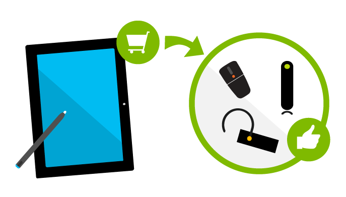
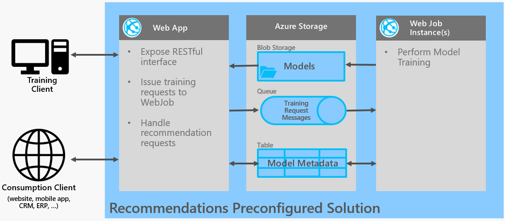

# Product Recommendations Solution

## Overview

This solution enables you to create product recommendations predictive models based on historical transaction data and information on the product catalog.

The following scenarios are supported by the SAR algorithm:

1. **Item-to-Item Recommendations.**
This is the "Customers who liked this product also liked these other products" scenario.
Increase the discoverability of items in your catalog by showing relevant products to your customers.

2. **Personalized Recommendations.** By providing the recent history of transactions for a given user, the SAR algorithm can return personalized recommendations for that user. 

At a high level, The solution exposes mechanisms to:
1. Train models using the SAR (Smart Adaptive Recommendations) algorithm. 
2. Request a previously created model for recommendations.

## Deployment Instructions

Before you can use the solution, you need to deploy it. 

Click on the following button to be redirected to the deployment instructions page.

## Training your first model

Once you have deployed your solution, you will be ready to follow step-by-step instructions on how to create your first model using the [Getting Started Guide](getting-started.md).

The [API Reference](doc/api-reference.md) explains in more detail each of the APIs exposed by your newly created solution.

## High level architecture

This solution creates a new Azure Resource Group in your Azure subscription with the following components:

1. An [Azure WebApp](https://azure.microsoft.com/en-us/services/app-service/web/) (and a respective Web Job)
The Azure Web-Application exposes a RESTful interface (See API Reference section) that allows you to train
recommendations models, and then query those models for product recommendations. The Azure Web-Application also
delegates training jobs to an [Azure WebJob](https://docs.microsoft.com/en-us/azure/app-service-web/websites-webjobs-resources).

2. An [Azure Storage](https://azure.microsoft.com/en-us/services/storage) subscription that is used for storing models, 
model metadata as well as for WebApp to WebJob communication.

## Questions?

Contact [mlapi@microsoft.com](mailto:mlapi@microsoft.com) with any additional questions or comments you may have on the usage of the Recommendations solution.

## Contributing
See the [Contributing Document](CONTRIBUTING.md) to understand contribution guidelines and code of conduct.

## License

See the [License Document](LICENSE.md).
