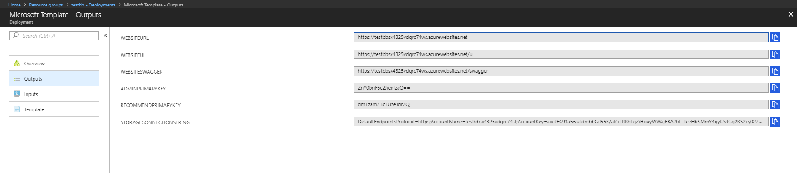
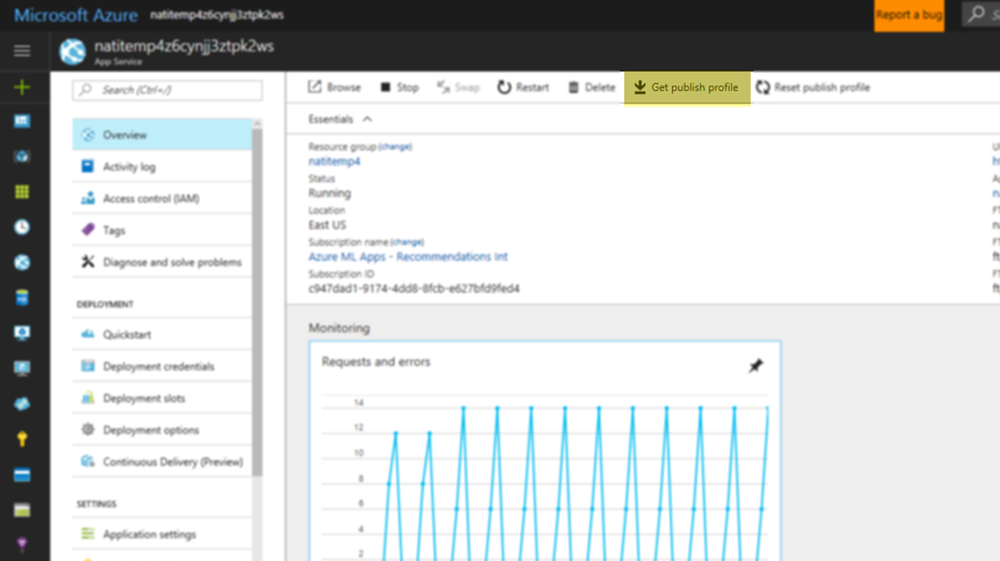
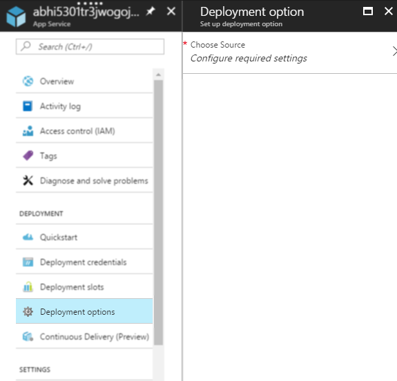
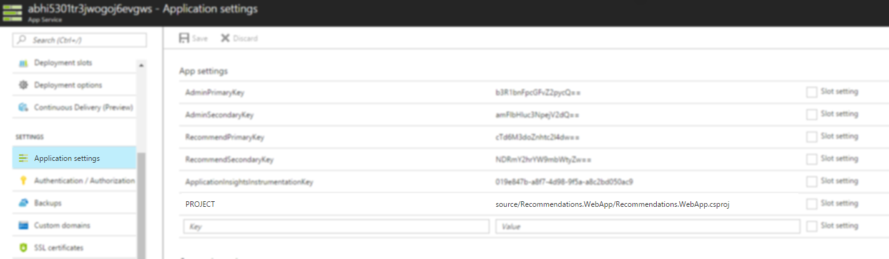
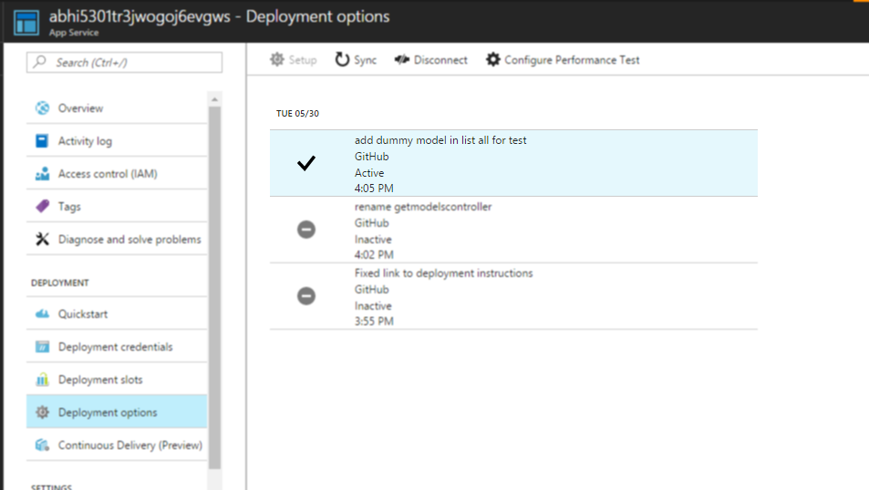

# Product Recommendation Solutions deployment via ARM

<a href="https://portal.azure.com/#create/Microsoft.Template/uri/https%3A%2F%2Fraw.githubusercontent.com%2FMicrosoft%2FProduct-Recommendations%2Fmaster%2Fdeploy%2Fresources.json" target="_blank">
    
</a>

## Deployment Instructions

Before proceding, please ensure that you have an active Azure Subscription. If you do not, create one by visiting the [Azure Portal](https://portal.azure.com/). Once this is complete, click on the Deploy To Azure button above. The default parameters should suffice. If you wish to change them, you may go ahead and select a different value from the dropdown for the Account Type, Hosting Plan Sku, and the App Insights Location. We recommend leaving the Deploy Package Uri to its default value.

Once your deployment is complete, please return here to read the Next steps.

## Next Steps - Post Deployment

Congratulations, the Recommendations solution has been deployed to your Azure subscription!!
You can use this service to train recommendation models and to get product recommendations.

### Deployment information

Please take note of the following pieces of information so you can use them to access the newly created RESTful endpoint that you can use to train models, and get product recommendations from
those models. 

To get the following values, you must go to the Deployment page for the deployment which you just created in the Azure Portal. This can be found in the resource group that was just created (under the deployments section). This screenshot should help you find the deployments page.


Once here, please click on Outputs to see the deployments outputs which you'll need to get the values in the table below. This screenshot should help you find the deployment outputs.



|*Output Description* |*Output parameter in Deployment Outputs*|
|-----------|----------|
|**End Point (WEBSITEURL)**|WEBSITEURL Output |
|**Recommendations UI**|{WEBSITEURL Output}/ui |
|**Swagger**|{WEBSITEURL Output}/swagger |
|**Admin Key (Primary)**|ADMINPRIMARYKEY Output |
|**Recommender Key** |RECOMMENDPRIMARYKEY Output |
|**Storage Account Connection String**|STORAGECONNECTIONSTRING Output |

&nbsp;
  
The *Admin Key* can be used for all API operations, including model creation and deletion.
The *Recommender Key* can only be used to get recommendations. This is the key you would use on the client or website requesting recommendations.

These **keys can be found and changed** in the [Azure Portal](https://portal.azure.com/), under **Application Settings** of the newly created App Service.

## Using your newly created solution

Once all the resources have been deployed, you will be provided two keys (*adminKey* and *recommendKey*) 
that can be used to access a newly create RESTful endpoint that you can use to train models, and get product recommendations from
those models.  Take note of those keys, as you will need them later on.

The *adminKey* is the key that can be used for all API operations and gives full error stack on any internal errors, the *recommendKey* can only be used to 
get recommendations, so this is the key you would use on the client or website requesting recommendations.

Those keys can also be found in the  [Azure Portal](http://portal.azure.com/), as **Application Settings** for the newly create AppService.

Congratulations! You now have a recommendations service you can use to train models.
Take a look at the [Getting Started Guide](../getting-started.md) to learn how to create your first model.  If you want to learn abut the APIs exposed you can also take a look at the [API Reference](../doc/api-reference.md).


## Re-deploying new code to the deployed solution

To deploy new version of the code on an already deployed solution, there are several possible ways. Two of the many approaches are described below:

#### 1. Ad-hoc deployment using Visual Studio

Manual deployments can be performed from visual studio. More details [here](https://msdn.microsoft.com/en-us/library/dd465337(v=vs.110).aspx).

###### Pre-requisites
1. Visual Studio 15 or greater
2. Local clone / copy of the source code solution - https://github.com/Microsoft/Product-Recommendations/tree/master/source
3. Azure Subscription Access on which solution was originally provisioned.


###### Steps
1. Download the publishing profile from the deployed App Service via Azure portal

2. Open the Recommendations solution - **Recommendations.Core.sln**
3. Right click on the **Recommendations.WebApp** project from the **Solution Explorer** and click **Publish**
4. Import the publishing profile from **step 1**. Refer to [Creating a Publish Profile](https://msdn.microsoft.com/en-us/library/dd465337(v=vs.110).aspx#Anchor_0).
5. Publish the changes. Refer to [Previewing Changes and Publishing the Project](https://msdn.microsoft.com/en-us/library/dd465337(v=vs.110).aspx#Anchor_4).

#### 2. Continous deployment from Azure Portal

An automated pipeline can be setup to code-build-deploy new changes. More details are [here](https://github.com/Microsoft/azure-docs/blob/master/articles/app-service-web/app-service-continuous-deployment.md).

###### Pre-requisites
1. Azure Subscription Access on which solution was originally provisioned.

###### Steps

1. Fork the git hub [project](https://github.com/Microsoft/Product-Recommendations)
2. Open **Deployment options** in the deployed App Service on Azure Portal.
    
3. Choose source as **Github** and select the project Production Recommendations (forked) and hit OK.
4. **Important** - Since the github project contains multiple solutions, we need to set the one we want to use explicitly. This can be done by adding a new setting in **Application Settings** of the App.

    `Key - PROJECT`

    `Value - source/Recommendations.WebApp/Recommendations.WebApp.csproj`
    
    
5. Any changes pushed to the forked branch will be automatically built and deployed.



### Additional Resources

#### [Getting Started Guide](https://go.microsoft.com/fwlink/?linkid=847717)

Learn how to create your first model.  

#### [API Reference](https://go.microsoft.com/fwlink/?linkid=849030)
Learn about the APIs exposed by the endpoint. You can also take a look at the [Swagger interface]({Outputs.websiteUrl}/swagger) for your service.

#### [C# Sample](https://go.microsoft.com/fwlink/?linkid=847717&pc=c-sharp-sample)
Train your first model and get recommendations using the [sample code](https://go.microsoft.com/fwlink/?linkid=847717&pc=c-sharp-sample). For your convenience, you can simply replace the below code snippet in the sample to get it working with this deployment:

```
string recommendationsEndPointUri = @"{WEBSITEURL Output}";  
string apiAdminKey = @"{ADMINPRIMARYKEY Output}";
string connectionString = @"{STORAGECONNECTIONSTRING Output}";
```