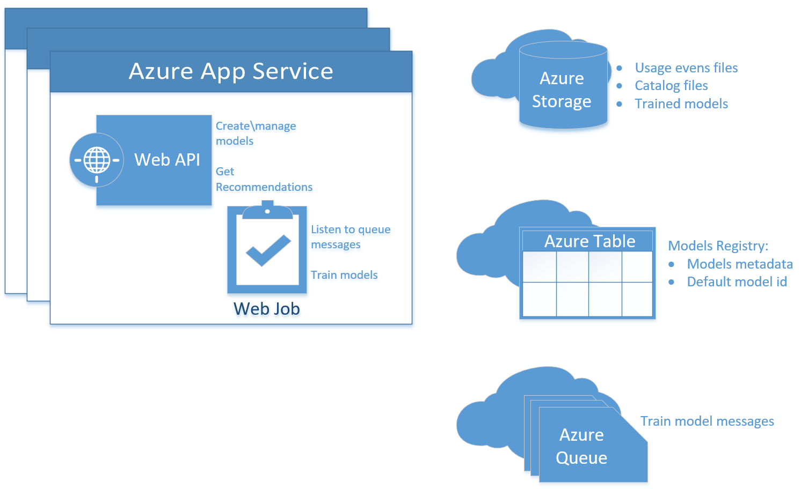
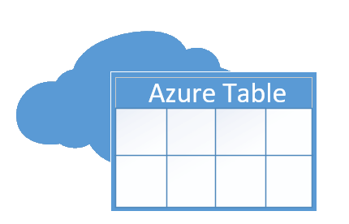
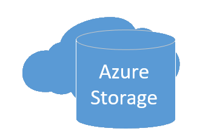
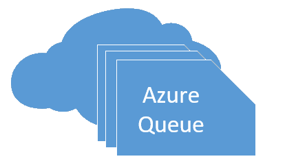
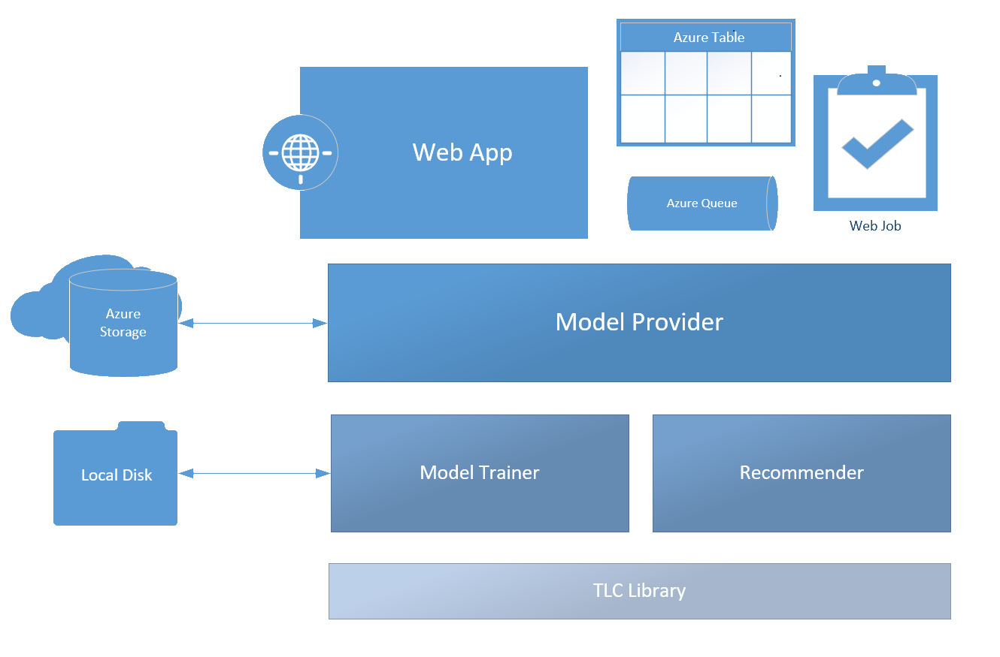

# Recommendations Service Architecture

## Recommendations Web App

The recommendation web app is an [Azure App Service](https://azure.microsoft.com/en-us/services/app-service/web/) web application that exposes a 
RESTful API for creating (training) and managing models as well as getting recommendation using trained models (see [API Reference](api-reference.md)). 
When a new model creation (training) request is received, the web app creates an entry for the new model in the [Model Registry](#model-registry) Azure 
Table Storage, with a status of *Created*, and enqueues a new message the *[Train Model](#train-model-queue)* Azure Queue Storage, to be processed by 
the [Recommendations Web Job](#recommendations-web-job). The new model id (GUID) is returned in the HTTP response.

The web app also exposes APIS for listing, retrieving models by querying\updating the [Model Registry](#model-registry).
When a delete model request is received, the model record is removed from the [Model Registry](#model-registry) and a new message is enqueued 
to the *[Delete Model](#delete-model-queue)* Azure Queue Storage, to be processed by the [Recommendations Web Job](#recommendations-web-job).

When handling a get recommendations request, the [Model Provider](#model-provider) loading the trained model into memory (if not already cached) 
and use it to produce recommendations. For more information about the recommendation algorithm, see [SAR](sar.md).

## Recommendations Web Job

The recommendations web job is an [Azure Web Job](https://docs.microsoft.com/en-us/azure/app-service-web/websites-webjobs-resources) process is 
defined on every instance of the Web App.

The web job listens to the *[Train Model](#train-model-queue)* for new model training requests.
Once a new message is found, the web job queries for the [Model Registry](#model-registry) for the model details and training parameters. 
The process of training a model then starts (see [Model Training Flow](#model-training-flow)) and continuously updates the model status in 
[Model Registry](#model-registry), making the progress accessible via the API. Once completed, the model's status is updated to either *Completed* 
or *Failed*. If successful, the trained model is serialized and uploaded to Azure Blob Storage, using the [Model Provider](#model-provider).
Models with status *Completed* can be used for getting recommendations using the API.

The web job also listens to the *[Delete Model](#delete-model-queue)* for model deletion requests. 
Once a new message is found, the [Model Provider](#model-provider) is used to deleted the trained model blob (if exists) from Azure Storage.

## Model Registry

The Model Registry is an [Azure Table Storage](https://azure.microsoft.com/en-us/services/storage/tables) that stores models information.
Every model is defined by a single row (or "table entity") which mainly holds the model id, creation time, status, training parameters and training statistics. 
The model registry is managed by the [Web App](#recommendations-web-app), meaning only the web app should create\delete model entities from the table. 
Updating a model entity could be done by any component.
 
## Model Provider

The Model Provider is a logical entity responsible for storing and retrieving trained models from a designated container in 
[Azure Blob Storage](https://docs.microsoft.com/en-us/azure/storage/storage-introduction). Trained models are serialized and stored as blobs 
under a relative location that corresponds to the model id under the '*models*' blob container.
The models storage container and blobs are managed by the [Web Job](#recommendations-web-job), meaning only the web job should create\delete trained model blobs. 
Reading\using a trained model blob could be done by any component.

The Model Provider also exposes a code api for training and getting recommendations, wrapping the internal training\recommender classes - 
see [Code Structure](#code-structure).

## Train Model Queue

The Train Model Queue is an [Azure Queue Storage](https://azure.microsoft.com/en-us/services/storage/queues) used by the [Web App](#recommendations-web-app) 
to signal the [Web Job](#recommendations-web-job) to start then process of training a new model (see [Model Training Flow](#model-training-flow)).
If handling of a queue message (i.e. training a model) fails a few times, the message is moved to a *poison* queue, which when handled marks the model status 
as *Failed* in [Model Registry](#model-registry).

## Delete Model Queue

The Delete Model Queue is an [Azure Queue Storage](https://azure.microsoft.com/en-us/services/storage/queues) used by the [Web App](#recommendations-web-app) 
to signal the [Web Job](#recommendations-web-job) to stop model training (if in progress) and delete the trained model resources from Azure Blob Storage (if exists).

## Model Training Flow

### Background

Recommendations model training is the process of processing an input of usage events, catalog (optional) and configuration settings ("training parameters") and yielding a binary that could be used to get item recommendations. 

If provided, a **catalog** is basically a list of items, where every item has an item id (string) and a set of *features* (key-value pairs) that describes the item. One example is a books catalog, where every book is an item with features such as published year and\or genre. 

**Usage events** are a record of how the items were used. At its basic form, a usage event is comprised out of a user id (string) and an item id (string). In addition, usage event may also provide a timestamp value. Usage events are essential for the recommendation algorithm which looks for correlations between the different users usage patterns (see [SAR algorithm](sar.md)).

The **training parameters** are the configuration that enables one to fine tune the recommendation algorithm. 
The quality of a trained model could be evaluated by using [Model Evaluation](model-evaluation.md).

### Training Flow

1. Download the catalog file (if available) and the usage file(s) from Azure blob storage. 
2. Parse the catalog file into in memory objects
3. Create an index that maps user ids (string) to numeric values
4. Parse the usage file and sort it according to the training parameters. 
5. Create an index that maps item ids (string) to numeric values
6. Core train using the underlying TLC library
7. Run model evaluation if evaluation usage files were provided. For more info, see [Model Evaluation](model-evaluation.md).
8. Get recommendations for a sample of usage events to get a normalization factor for score values
9. Serialize and persists the trained model along with the item id index and additional properties to Azure blob storage

## Code Structure
 
 

 The Recommendation service code is divided into layers, where the bottom most layer is the *TLC library* which is a set of machine learning algorithms that 
 the service use for both training and scoring (i.e. getting recommendations). The library gets in-memory representation of the catalog & usage events as input for training\scoring.

 Above the TLC layer, the *Model Trainer* and *Recommender* resides. Those classes are abstraction over the TLC layer, consuming catalog & usage events as local disk files.
 The Model Trainer parses and transforms the input files to the format accepted by the TLC layer. Model training result at this layer is an in-memory instance, holding the underling 
 TLC-trained model and additional required contracts (e.g. a map between 'external' string catalog items ids and the 'internal' numeric ids).
 The Recommender class can use that in-memory trainer model class and some parameters to compute recommendations.
 
 Above this layer, we find the [Model Provider](#model-provider), which can download catalog & usage events Azure blob files to local disk, to be used by the Model Trainer.
 In addition, the [Model Provider](#model-provider) is responsible for [caching](#caching) Recommender objects for better performance.

 At the top most layer we find the [Web App](#recommendations-web-app) and the [Recommendations Web Job](#recommendations-web-job) that utilize the [Model Provider](#model-provider)
 and [Model Registry](#model-registry) to keep record, train and get recommendation from models. 
 
 ## Caching
In-memory caching is used to improve get recommendation API performance. 

There are two levels of caching:
At the top level, the [Model Provider](#model-provider) caches **Recommender** objects. 
Every Recommender object is associated with a specific model. Recommender objects are kept cached in memory using a sliding window of one day, meaning that if no 'get recommendations' requests are received for that model, the model will be removed from the cache. 

At a lower lever, Recommender objects keep an internal cache of an even lower level *Scoring Engine* objects. 
Scoring Engine is the underlying TLC's object that is used to "score" (get recommendation) items. A Scoring Engine object is a combination of a trained model and scoring-time arguments (e.g. the number of requested recommendations, the latest usage event's timestamp). For that reason, it is likely for a single model to have multiple Scoring Engines, and that is why Recommender objects keep a cache. Similarly to the top level cache, Scoring Engine objects leave the cache is not used after one day. 

## Microsoft.MachineLearning.TLCRecommendations.dll

The core algorithm that produces the models and is used to score the models is a black-box DLL. (Microsoft.MachineLearning.TLCRecommendations.dll). This DLL is not meant to be consumed and/or supported outside of this solution template. As such, the DLL is not publicly documented.

