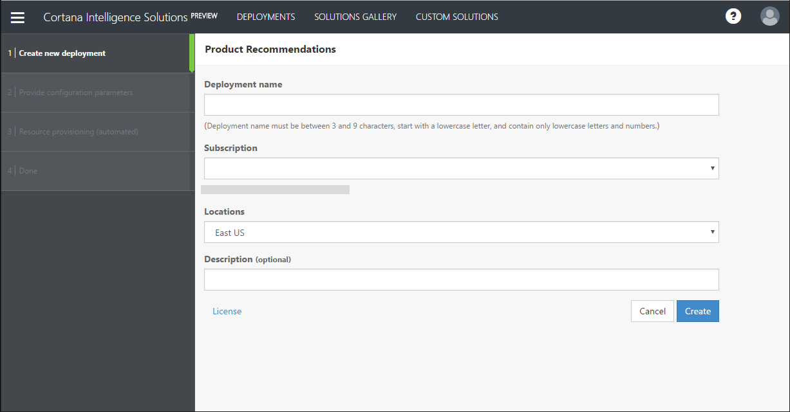
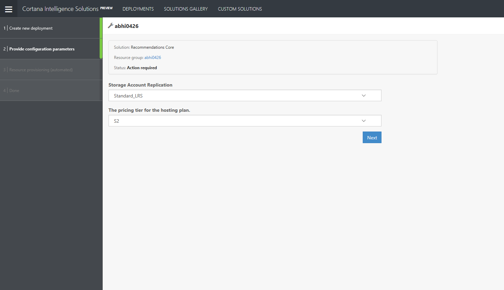

# Product Recommendations Preconfigured Solution Deployment Instructions

This document outlines step-by-step what you need to do to deploy the recommendations preconfigured solution.

## Before you get started...

If you don't already have an [Azure account](http://portal.azure.com/), you will need to create one as this solution
deploys a fully functioning recommendations-service to your subscription.

## Installing the preconfigured solution

1. Go to the [Product Recommendations Template](https://aka.ms/recotemplate) on the Cortana Analytics Gallery.

2. Click **Deploy**. This will take you to a wizard that will help you deploy the solution.

3. Enter the **Deployment Name**,  select the **Subscription** where you would like to install the solution, the **Location**  (Region) for the deployment.
   You may also enter an optional **Description** for your deployment.

4. Click **Create**

## Provide configuration parameters.

You will select a few parameters that will impact the size of the resources that will be created.  

1. The solution will create an Azure Storage account where the models will be stored. The storage
account is also used to store model-metadata and any state required for the solution to work. 
Specify the type of [replication](https://docs.microsoft.com/en-us/azure/storage/storage-introduction) that you
would like on your storage account. Note that the models you create will be stored in the
storage account to be create.

2. The solution will run as an [Azure WebApp](https://azure.microsoft.com/en-us/services/app-service/web/).
You will need to select the [hosting plan](https://azure.microsoft.com/en-us/pricing/details/app-service/) . 
This will impact the size of your machine, and therefore the number of models you can concurrently train as well 
as how quickly you will be able to score requests. We have [benchmarked](benchmarks.md) a few scenarios to help you choose the right one.

    If you want to increase the size of the scale up or scale out after deployment, you can do that from 
    the [Azure Portal](https://docs.microsoft.com/en-us/azure/app-service-web/web-sites-scale).

3. Click **Next**

## Using your newly created solution

Once all the resources have been deployed, you will be provided two keys (*adminKey* and *recommendKey*) 
that can be used to access a newly create RESTful endpoint that you can use to train models, and get product recommendations from
those models.  Take note of those keys, as you will need them later on.

The *adminKey* is the key that can be used for all API operations and gives full error stack on any internal errors, the *recommendKey* can only be used to 
get recommendations, so this is the key you would use on the client or website requesting recommendations.

Those keys can also be found in the  [Azure Portal](http://portal.azure.com/), as **Application Settings** for the newly create AppService.

Congratulations! You now have a recommendations service you can use to train models.
Take a look at the [Getting Started Guide](../getting-started.md) to learn how to create your first model.  If you want to learn abut the APIs exposed you can also take a look at the [API Reference](api-reference.md).